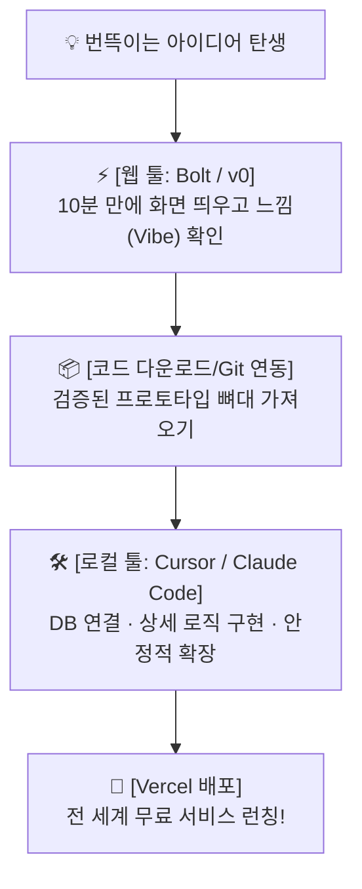

# Chapter 03. 웹 툴의 명확한 한계: 내 컴퓨터(로컬 환경)로 넘어가야 하는 결정적 이유
## 1. 🎯 [디렉터 브리핑] 이번 챕터 미션
- "웹 툴([Bolt.new](http://Bolt.new), v0)이 이렇게 편한데, 왜 굳이 내 컴퓨터에 복잡한 개발 도구를 설치해야 할까?"라는 독자의 핵심 의문을 해소합니다.
- 웹 AI 빌더의 5가지 치명적인 한계를 이해하고, **'진짜 서비스'를 만들기 위해 로컬 개발 환경(Cursor, Claude Code)으로 전환해야 하는 당위성**을 깨닫습니다.
- 웹 툴과 로컬 도구를 완벽히 조화시키는 **'프로 디렉터의 하이브리드 워크플로우'**를 확립합니다.
---
## 2. 💡 [1분 개념] '로컬 환경'이란 내 방에 차린 정식 공방입니다
웹 AI 빌더([Bolt.new](http://Bolt.new), v0)는 **'쇼핑몰 시식 코너'**나 **'원데이 클래스 공방'**과 같습니다.  
도구도 다 빌려주고 재료도 세팅되어 있어 10분 만에 그럴듯한 결과물을 맛보기엔 최고지만, 내가 만든 도자기(코드)를 내 맘대로 장식장에 진열하거나 대량 생산해 판매하기엔 제약이 너무 많습니다.
반면 **'로컬 환경(내 컴퓨터)'**은 **'내 방에 제대로 차린 나만의 전용 공방'**입니다.  
내 하드디스크에 프로젝트 파일들이 안전하게 보관되고, 어떤 도구든 자유롭게 가져다 쓸 수 있으며, 문제가 생겨도 내 손으로 모든 것을 통제할 수 있습니다. 진짜 비즈니스를 시작하려면 결국 내 공방이 있어야 합니다.
---
## 3. 웹 AI 빌더의 5가지 치명적 한계
2장에서 10분 만에 루틴메이트의 멋진 프로토타입을 만들어보았습니다. 하지만 여러분이 이 프로토타입을 진짜 상용 서비스로 키우려고 하면, 곧바로 다음과 같은 5개의 거대한 벽을 마주하게 됩니다.

| 한계 영역 | 웹 AI 빌더 ([Bolt.new](http://Bolt.new) / v0)의 현실 | 로컬 환경 (Cursor / Claude Code)의 차이점 |
| --- | --- | --- |
| **1. 비용과 토큰 소진** | 몇 번 질문하다 보면 하루 무료 크레딧이 바닥나고, 매달 \$20~\$50의 비싼 구독료를 내야 계속 작업할 수 있음. | 내 로컬 파일은 무료로 자유롭게 열고 편집할 수 있으며, 필요한 AI 모델(저렴한 Flash 모델 등)을 골라 써서 **비용을 90% 절감** 가능. |
| **2. 파일 관리와 통제권** | 파일이 20~30개가 넘어가면 AI가 어떤 파일을 수정했는지 알 수 없고, 브라우저가 버벅거리며 멈춤 (블랙박스 현상). | 내 컴퓨터 폴더에 모든 파일이 훤히 보이며, VS Code 기반의 강력한 파일 탐색과 코드 검색으로 **완벽한 통제력 확보**. |
| **3. DB & 서드파티 연동** | 카카오 로그인, 토스페이먼츠 결제창, 이메일 발송 등 복잡한 외부 서비스를 브라우저 가상 환경에서 테스트하기 극히 까다로움. | Supabase, 결제 모듈, 외부 API를 실제 운영 환경과 똑같이 내 컴퓨터에서 자유롭게 테스트하고 연동 가능. |
| **4. 세이브포인트 (Git)의 부재** | AI가 다음 기능을 붙이다가 기존 코드를 엉망으로 덮어썼을 때, 직전 상태로 완벽히 되돌리기(Rollback) 어려움. | **Git 타임머신**을 이용해 AI가 망치기 1초 전 상태로 언제든지 완벽 복구 가능. |
| **5. 자산(Asset)의 종속성** | 해당 웹 서비스 사이트가 점검 중이거나 정책을 바꾸면 내 프로젝트 작업이 완전히 중단됨. | 모든 소스코드가 내 컴퓨터 하드디스크에 영구 보존되므로 **온전한 나의 디지털 자산**이 됨. |

---
## 4. 프로 디렉터의 '하이브리드 워크플로우'
그렇다면 웹 AI 빌더는 이제 쓸모없는 걸까요? **전혀 아닙니다.**  
똑똑한 AI 디렉터는 두 환경을 다음과 같이 나누어 씁니다:

1. **아이디어 스케치 단계 (Web)**: `v0`나 `Bolt.new`에서 10분 만에 화면과 프로토타입을 빠르게 뽑아보며 "이 느낌이 맞는지" 검증합니다.
2. **진짜 서비스 구축 단계 (Local)**: 검증된 코드를 내 컴퓨터(Cursor)로 가져와 Supabase 데이터베이스를 붙이고, 깃 세이브포인트를 찍으며 견고하게 살을 붙여 나갑니다.
---
## 5. 🚀 앞으로의 여정: 진짜 작업실로 떠날 시간!
우리는 Part 1을 통해 **"코딩 한 줄 몰라도 10분 만에 작동하는 웹앱을 만들 수 있다"**는 짜릿한 도파민과 자신감을 얻었습니다.  
그리고 동시에 **"진짜 서비스를 만들기 위해서는 웹 툴의 울타리를 넘어 내 컴퓨터에 진짜 작업실을 차려야 한다"**는 이유도 명확히 알게 되었습니다.
이제 다음 파트부터 본격적인 진짜 바이브 코딩이 시작됩니다!
- **Part 2. 기획의 정석**: AI가 내 말을 찰떡같이 알아듣고 탈선하지 않도록 만드는 **'스펙 주도 바이브 코딩(SDD)'** 기획법을 배웁니다.
- **Part 3. 작업실 세팅**: 프로 개발자들의 비밀 무기인 **Cursor**를 설치하고, 공식 GitHub 스타터 템플릿을 클릭 한 번으로 내 컴퓨터에 세팅합니다.
**준비되셨나요? 이제 장난감 시식 코너를 나와, 진짜 나만의 개발 스튜디오로 들어가 봅시다!**
